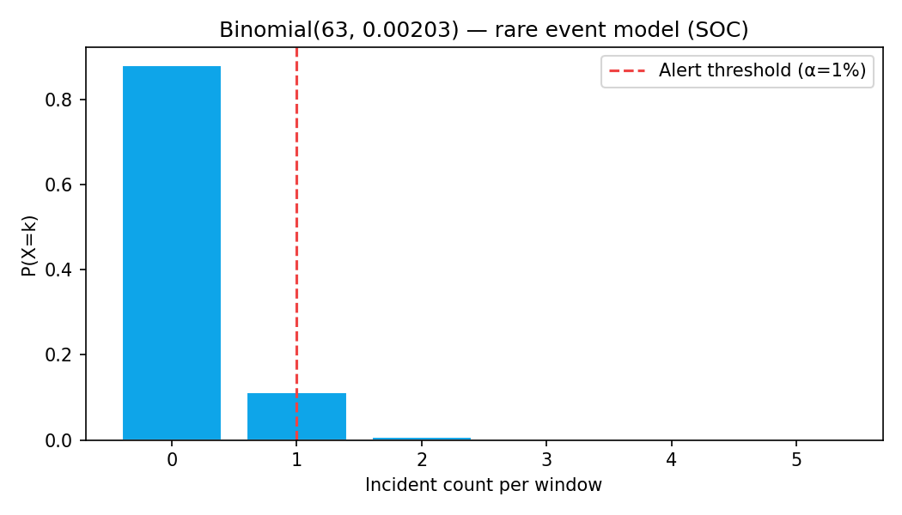
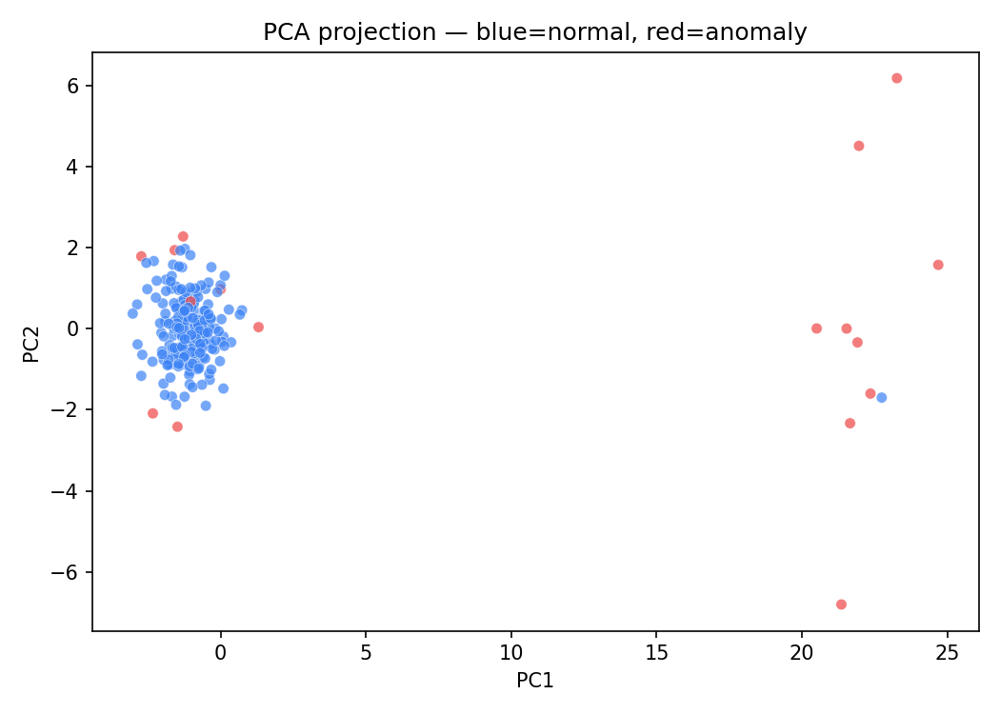
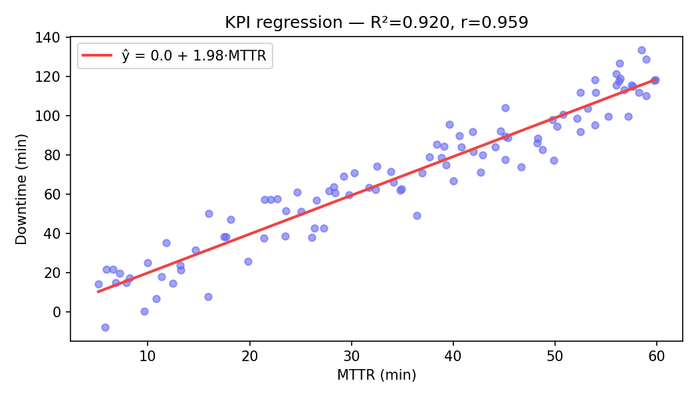

# mitx-6419x-genomics-anomaly

**MITx 6.419x — Data Analysis: Statistical Modeling and Computation in Applications**

Pipeline estatístico de alta dimensão: modelos de contagem (binomial), redução dimensional (PCA) e detecção de anomalias — do contexto genômico ao monitoramento NOC/SOC.

---

## Resultados em destaque

| Módulo | Métrica | Valor |
|--------|---------|-------|
| `count-models` | E[X] para Binomial(63, 0.00203) | **0.128** eventos/janela |
| `pca-anomaly` | Anomalias detectadas (210 amostras, 5%) | **17** pontos flagged |
| `regression` | MTTR → Downtime | **R² = 0.909**, r = 0.954 |

---

## Figuras

### Modelo de contagem — incidentes raros (SOC)



Parâmetros do **exercise12** do 6.419x (`n=63`, `p=0.00203`) reinterpretados como janela de observação SOC. Threshold de alerta em 1 evento (α = 1%).

### PCA + detecção de anomalias



Pipeline: `StandardScaler → PCA(5) → k-means(3) → distância ao centróide → top 8%`.

### Regressão de KPIs operacionais



Cada ponto-minuto de MTTR associa-se a ~2 min de downtime adicional — base para SLAs e capacity planning.

---

## Módulos

| Módulo | Técnica | Comando |
|--------|---------|---------|
| `count-models/` | PMF binomial, threshold de alerta | `python count-models/run.py` |
| `pca-anomaly/` | PCA + k-means + distância | `python pca-anomaly/run.py` |
| `regression/` | Pearson + OLS | `python regression/run.py` |

## Ponte genômica → observabilidade

| Genômica (curso) | Observabilidade (este repo) |
|------------------|----------------------------|
| k-mer frequency matrix | Feature matrix de logs |
| PCA de fragmentos | Redução de dimensionalidade |
| Cluster de expressão | Segmentação de comportamento |
| Contagem de reads | Contagem de incidentes |

## Setup

```bash
pip install -r requirements.txt
python docs/generate_figures.py
```

## Portfólio

- [Portfolio AI Engineer / CTO](https://portfolio-ai-cto-guaranta.netlify.app)

## Autor

**Guarantã Almeida** — [github.com/guaranta](https://github.com/guaranta)
